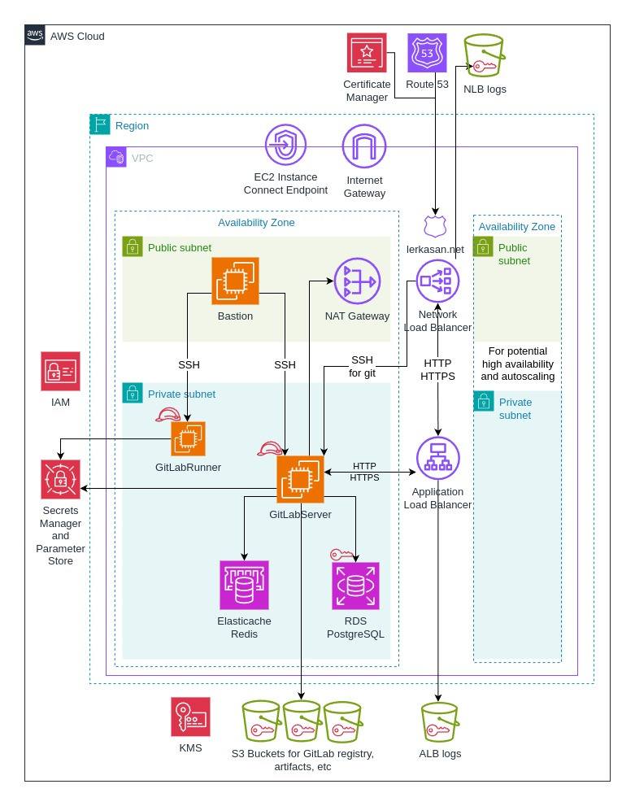

# Deployment of a Self-Managed GitLab EE server with runners on AWS

**The installed self-managed GitLab EE server is available at https://gitlab.lerkasan.net**

This repository contains infrastructure-as-code (IaC) configurations and automation scripts for provisioning a self-managed GitLab on Amazon Web Services. All infrastructure components are provisioned using **Terraform**, and system-level configuration is performed via **cloud-init** bash scripts.

## Infrastructure Architecture

<picture>
  <source media="(prefers-color-scheme: dark)" srcset="img/infra_dark.jpg">
  <source media="(prefers-color-scheme: light)" srcset="img/infra_light.jpg">
  
</picture>

## Prerequisites

To deploy the infrastructure, the following prerequisites should be met:

- AWS IAM user with valid credentials and permissions to create resources listed below:
    - VPC
    - EC2
    - RDS
    - Elasticache
    - S3
    - IAM
    - Route 53
    - Certificate Manager
    - SSM parameters
    - Secrets Manager
    - KMS

- Terraform version 1.12 or higher
- A valid domain name configured in Route 53
- Existing EC2 key pairs for SSH access to EC2 instances:
    - Bastion jump host
    - GitLab EE server
    - GitLab runner
- Two parameters created in AWS SSM Parameter Store named
    - gitlab_root_password
    - gitlab_personal_token

A value for `gitlab_root_password` parameter can be any strong password that will be used to access GitLab EE website.

A value for `gitlab_personal_token` parameter can be obtained after installing Gitlab EE and creating a personal access token.
The scope of this token should include:
 - create_runner
 - manage_runner
 
Please refer to the [official GitLab documentation](https://docs.gitlab.com/user/profile/personal_access_tokens/) for more information about personal access tokens.

## How to run this code

1. Create file **variables.tfvars** in a directory **infra** and assing values for variables.

    *Note:* Examples of variables and their values can be found in the file **infra/variables.tfvars.example**

    **Do not add variable `ec2_runners` to the file `variables.tfvars` yet.**
2. Create parameter `gitlab_root_password` in AWS SSM Parameter Store.

3. To provision AWS infrastructure and set up GitLab EE server, open the directory **infra** and run the following commands in the terminal:

    `terraform init`

    `terraform plan` to verify intended changes

    `terraform apply` to verify intended changes again, afterwards type "yes" to confirm or "no" to cancel.
4. Log in to GitLab EE website, create a personal access token, and copy it to the parameter `gitlab_personal_token` in AWS SSM Parameter Store.  
   
5. To set up GitLab runner, add variable `ec2_runners` to the file`variables.tfvars` and run commands:

    `terraform plan` to verify intended changes

    `terraform apply` to verify intended changes again, then type "yes" to confirm or "no" to cancel.

## Clean up

To destroy the infrastructure and GitLab servers, run command `terraform destroy` and type "yes" to confirm.

## Further Enhancements

- Add support for auto-scaling of GitLab Server and Runners
- Integrate with monitoring in Prometheus + Grafana
- Collect logs in Loki
- Automate backups
- OS hardening

